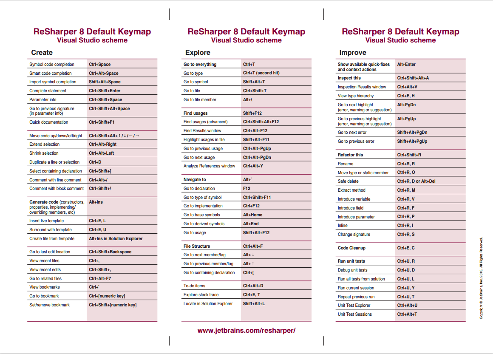

When coding in C# with Visual Studio usually you get enough help with Intellisense and [Visual Studio shortcuts](http://visualstudioshortcuts.com/), which there are plenty:

>

Anyway, it's very common to see developers using extra tools as [Resharper](https://www.jetbrains.com/resharper). I'll copy paste the definition from their website:

ReSharper is a renowned productivity tool that makes Microsoft Visual Studio a much better IDE. Thousands of .NET developers worldwide wonder how they’ve ever lived without ReSharper’s code inspections, automated code refactorings, blazing fast navigation, and coding assistance.
{: .notice}

I have used it in several projects, but in the last one it is compulsory and it's when I have seen it's true power. I'm going to go through my favourite shortcuts and tricks from Resharper, it's important to notice I use the "Visual Studio scheme" but there is also option for the "IntelliJ scheme".

>

OK, enough introductions, what are my favourite shortcuts? here you go:


Alt + Enter


For everything, all the time Resharper will suggest actions in how to improve the code and with this shortcut you can go throught them. At the beginning simple things like an if else clause that can be converted to ?:, but you can also put a new paremeter in the constructor and "alt enter" it will suggest to create the field and initialize it inside the constructor, lovely.


Ctrl + T


Go to everything, and you can use wildcards or initials.


Ctrl + R + R


Renaming, can include comments.


Ctrl + R + M


Extract a method from the selected piece of code which takes me to the next shortcut:


Ctrl + Alt + Right
Ctrl + Alt + Left


Expand and shrink selection.


Ctrl + ,
Ctrl + Shift + ,


View recent files and recent edits. And finally 


Ctrl + Shift + V


Will show you a window with all your history in the clipboard, very useful when copypasting some code.
What are your favourite ones?