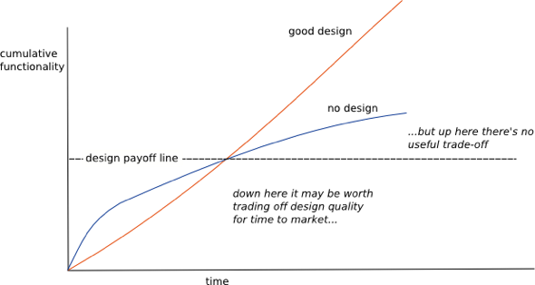

The analogy
----------

The term was first used by Ward Cunninham in 1992. He realized financial debt could be compared to technical debt in order to understand easily causes and consequences of it. 

* When in a project software it is decided to skip design decisions is like borrowing money from the bank.
* How do we pay this credit? When refactoring of this code is done principal is being payed.
* But all the credits have interest, don’t they? In technical debt after you skipped some design decisions for later the development will be slower, this will mean interest is being payed.
* We could say that when the whole project is a mess because interest was never payed is similar to when a company goes bankrupt.

 

Definition
----------

When defining it explicitly, not using and analogy, the definition I prefer is the following: **“You may need to use suboptimal designs in the short term, because the schedule does not allow longer term designs to be used”.**
It is important to clarify that technical debt is only valid when used consciously and when there is a plan to refactor in the future and how you will do it. Another term commonly used is “Design debt”.

Since I did the [MongoDB course](http://pallares.me/mongodb-for-NET-M101N/) I got involved in organizing a Hackaton in the [MEAN stack](http://mean.io/).

Example with Possible scenarios[^1]
----------

[^1]: <https://medium.com/@joaomilho/festina-lente-e29070811b84#.r5modcn0r>
Now let’s make an example. We are a software Company, an start-up. We are just beginning we don’t have much money, but we are lucky some possible customers are coming to see a prototype next week. We would get an initial investment that would help us grow.
Problem? We don’t have enough time to develop the user roles in the application in a proper way, with all the infrastructure.
What could we do? There are 3 possible scenarios:

* We decide consciously to develop just two types of users (admin, normal user) enough to see the functionality by the customers and simple enough to develop on time. Let’s say we use 4 story points, and will have to use 22 in the future for the refactor. We get 5 new clients and money from them.
* Another option is to not skip design and develop the whole infrastructure now, we wouldn’t be on time for the clients, no money would arrive, but the overall effort would be only 21 instead of 4+22.
* And the last option, we do it “quick” now and forget about refactoring. Very risky decision because if we don’t refactor the debt will grow exponentially and eventually we wouldn’t be able to fix the situation.

As you may be guessing, the best option is the first one. It’s one of the main reasons of taking debt, to arrive to a deadline but paying it as soon as possible before it gets out of hand.

When to take debt - Design payoff line[^2]
----------
[^2]: <http://martinfowler.com/bliki/DesignStaminaHypothesis.html>

 
As we saw with the previous example, technical debt is only worth up to a certain point. 
This graph tries to compare delivered functionality versus time in two different projects, one with good design (orange line) and another without design (blue line). The problem with no-design, is that by not putting effort into the design, the code base deteriorates and becomes harder to modify, which lowers the productivity soon after the project grows. Good design keeps its productivity more constant so at some point (the design payoff line) it overtakes the cumulative functionality of the no-design project and will continue to do better.
The million dollar question is, where is the design payoff line? At what time exactly is not worth it anymore? Of course this depends a lot in the project and other variables but maybe a lot sooner than expected, maybe just a few weeks from the start. This is of course an hypothesis, there is no proof, but it’s something many experienced people believes in.

What is not technical debt
----------

People can get confused and think that when somebody is writing smelly code is acquiring technical debt, no it isn’t.
Writing bad code is not technical debt, this is important to be clarified. When a development team produces poor quality code does not mean they are acquiring debt. In fact, you can take debt with good quality code, but not designed to grow in the future easily (without design).
If either the managers or the developers are not aware that they are creating technical debt and the implications this will have in the future, then we also can not consider it technical debt.

Conclusions
----------

To sum up:
Technical debt is a concept that should be known by the technical and the non-technical part of the Company.
Ignoring it can drive projects to failure due to accumulating to much debt and not paying it on time.
It can also help us in some scenarios to deliver a functionality.

