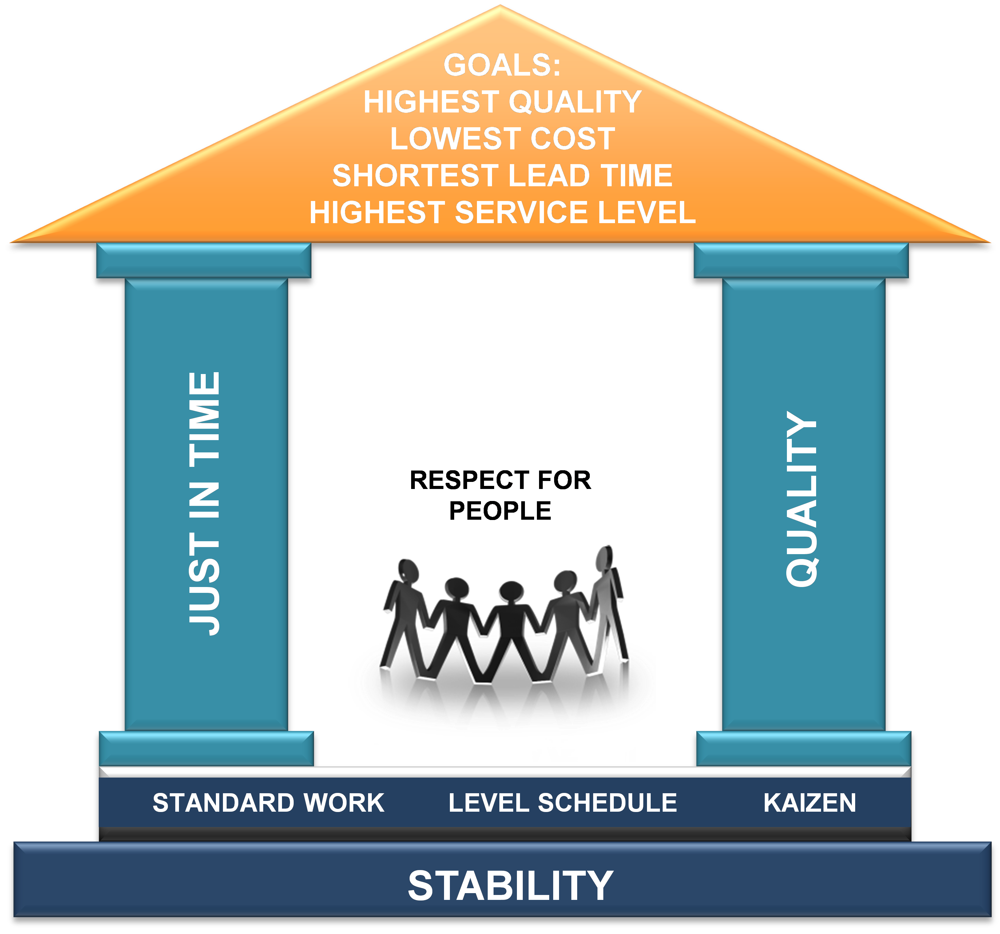
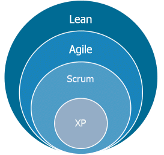

After asisting to a Meetup about Lean, I would like to share the main concepts I learned. Lean is centered on **making obvious what adds value by reducing everything else**.

It all started with **Toyota** in the 1930's. Due to the crisis they had to focus on quality and avoid over-production unlike the standards at that time (Ford - USA). The first step was using "kaizen", looking for continuous improvement to reduce all they could the errors in the manufacture process. It later evolved to [Toyota Production System (TPS)](https://en.wikipedia.org/wiki/Toyota_Production_System).

There are 8 types of waste that are pretty self-explanatory:

* Defects
* Overproduction
* Waiting
* Not utilizing talent
* Transportation
* Inventory excess
* Motion waste
* Excess processing

Continuous improvement can be separeted in three basic principles:

* **Challenge**: Having a long term vision of the challenges one needs to face to realize one's ambition. To do so, we have to **challenge ourselves every day** to see if we are achieving our goals.
* **Kaizen**: Good enough never is, **no process can ever be thought perfect**, so operations must be improved continuously, striving for innovation and evolution.
* **Genchi Genbutsu**: Going to the source to see the facts for oneself and make the right decisions, create consensus, and make sure goals are attained at the best possible speed.

Lean is also based in the respect for people:

* Respect
* Teamwork

The main concepts of lean can be seen in the "Lean house":

It is easy to see the relation of Lean with agile, scrum...but how do they interact? I like this diagram to explain how they are realted. Lean is the origin of everything.

 - center

During the event they showed this video I wanted to share, it shows in a practical and funny way how lean can help:
<iframe width="560" height="315" src="https://www.youtube.com/embed/wz28yMcDvVM" frameborder="0" allowfullscreen></iframe>
