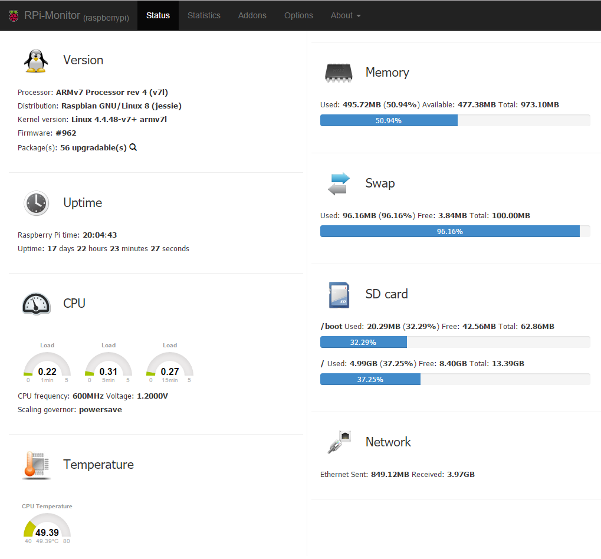

### Why?

I recently bought a Raspberry pi 3, it was improvised I had bought a Pine A64 but it was taking ages to arrive, then the new powerful version of the Pi appeared and I could not resist, Amazon and in couple days at home.

 

My plan for it was basically replicating the automatic downloading of torrents (movies and tv shows mainly). I had it in a PC so I had powered on all day. This way I would take advantage of the Pi low consumption. Also I would take the chance to refresh my unix knowledge.

Ingredientes:

* Raspberry Pi
* [SD Card](https://www.amazon.es/gp/product/B00J2BU7WO/ref=oh_aui_search_detailpage?ie=UTF8&psc=1) - 16Gb is more than enough, we will use an external disk for video storage
* [Case](https://www.amazon.es/gp/product/B00W7S1BFG/ref=oh_aui_search_detailpage?ie=UTF8&psc=1) (optional)
* [Power cable](https://www.amazon.es/gp/product/B01DDW0P1U/ref=oh_aui_search_detailpage?ie=UTF8&psc=1) (optional, you may have a spare one but I wanted a quality one with enough amperage)

### First steps

As you already know the Pi works with linux, there are all kind of images available to download but I choose the [recommended one](https://www.raspberrypi.org/help/videos/), Raspbian, looking for flexibility. The installation is very easy but keep in mind you will need a monitor with HDMI connection and a keyboard plugged in the Pi.

Once you have Raspbian up and running, next thing is to configure the Pi to be able to [work remotely with SHH](https://www.raspberrypi.org/documentation/remote-access/ssh/windows.md), then you can leave it somewhere hidden just connected to the power and the network (I recommend using the ethernet even if the Pi has wifi and the ethernet port is 10/100Mb only, I guess I’m old school)

### Mounting external drive

For media storage I used a 1TB USB external drive connected to the router, the process is a little bit more complicated than it if you have it directly connected to the Pi, but easy anyway. I followed the steps [here](http://raspberrypi.stackexchange.com/questions/40974/access-network-samba-share-from-pi-client). Basically these commands (for anonymous access):

```
apt-get install  samba-common smbclient samba-common-bin smbclient  cifs-utils
mkdir /mnt/abc
mount -t cifs //server/share /mnt/abc
```

I also configured a cronjob so in every reboot it automonts the network disk

```
@reboot sleep 10 && mount -a
```

### RPi-Monitor

To close this first post about the Pi, I want to talk about the RPi-Monitor, as the name says it’s a monitor that tells you basic information about the status of the Pi:



It’s perfect to detect if suddenly the CPU is under heavy load or it’s becoming too hot. It also helps track if you have the latest software installed.

### This is only the beginning

Next post we will start installing a torrent client, Deluge and software like Couch Potato and Sonarr, you will love it ;)

