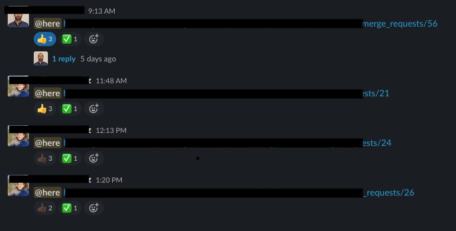

As I mentioned in the previous post, in my team [we are very used to be colocated and interact frequently](https://juan.pallares.me/remote-working-tips/). Also since we do pair programming the amount of MR that needs to be accepted by a third person was low, but then we started working fully remote and it all changed.

The team slack channel was flooded with:

- "Guys! I have a new MR!"
- "Sure but first look at mine, the one I posted this morning"
- "Hey but I already had a look at this MR!!"

And all this conversations lost in the middle of other valuable conversations that we have in our channel. It was starting to be a chaotic, and we software engineers don't like chaos.

What if we create a channel specific for the teams MRs? oh even better let's handle the status with the reactions/emojis so it's more visual and faster. This was the agreement we made:

The flow is the following:

1. A team member writes in the channel with a link to the MR and notifying the team with @here
1. Whenever somebody starts having a look sets the eyes reaction
1. When finishing reviewing:
   1. If there have been some comments. Sets the timer icon
   1. When comments are addressed, the author sets the glasses icon (not very related but is my favourite one)
1. When the reviewers feel the MR is ready to be merged, they set approved reaction.
1. Finally, when the creator merges (or closes) the MR. Sets de check reaction.

And this is how the channel looks after some time adapting to this new flow. Conversations about the MR go in a thread so there are only MR links in the messages in the channel.

Finally, we restored the order and peace in our beloved team channel. What are the challenges you are facing these days?
