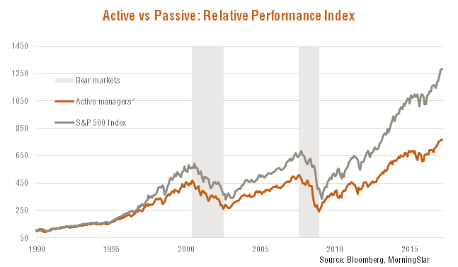

## Why passive investing

Recently I read a couple books that triggered and investigation in blogs and forums that was eye-opening:

- [The Simple Path to Wealth](https://www.amazon.com/Simple-Path-Wealth-financial-independence/dp/1533667926)
- [The Four Pillars of Investing](https://www.amazon.com/Four-Pillars-Investing-Building-Portfolio-ebook/dp/B0041842TW/ref=tmm_kin_swatch_0?_encoding=UTF8&qid=1587285907&sr=8-1)

The key idea for me is:

**Nobody can beat the market so you can't and neither a professional investor. It doesn't make sense to pay anybody to handpick you investment. How do we invest then? passive investing (index funds)**

An easy way to convince me is to show me data:

[Source](https://www.betashares.com.au/insights/passive-investment-cyclical/)

Source: The Four Pillars of Investing

In this graphic we can see how for the last 15 years if you invested directly in the S&P500 Index passively you would have beaten all the actively managed funds. Take into account that they have to beat the market consistently and with a margin that allows them to earn their fees and still provide you some benefits. Index funds fees are really low since they just have to replicate the index. Do you research, look for bigger periods of time, the same pattern appears.

## OK, how can I do it?

Let me introduce you [John C. Bogle](https://en.wikipedia.org/wiki/John_C._Bogle). He is the creator of this type of investment:

**_Bogle's innovative idea was creating the world's first index mutual fund in 1975. Bogle's idea was that instead of beating the index and charging high costs, the index fund would mimic the index performance over the long run—thus achieving higher returns with lower costs than the costs associated with actively managed funds._**

He created [The Vanguard Group](https://en.wikipedia.org/wiki/The_Vanguard_Group) which provides differents types of investments, index funds between them, but they key here is:

**_Vanguard is owned by the funds managed by the company, and is therefore owned by its customers._**

This is great, this means your investments are not filling the pockets of a bunch of chairmen that want more and more benefits each year. You are the owner, that explains why they have the lowest fees in the market, the bare minimum to have everything up and running.

If investing in index funds, you have to use Vanguard. In US they are easily available, in Spain at the time of writing the best option IMHO is [myinvestor](https://myinvestor.es/) since they don't have minimum amount of investment needed and don't have extra fees.

Vanguard not available in your country? Look for a similar option, main focus, low fees. Maybe Amundi?

You may be thinking: "Juan you are going to far, it doesn't matter to pay 2 or 3% per year in costs...let me quote a fragment of [The Simple Path to Wealth](https://www.amazon.com/Simple-Path-Wealth-financial-independence/dp/1533667926):

**_People underestimate the drag of costs to investing.
Paying fund and/or advisor fees of 1-2 percent seems low, especially in a good year. But make no mistake, these annual fees are a devil’s ball and chain on your wealth. As a point of reference, the average mutual fund ER (expense ratio: the fee funds charge investors) is ~1.25%. The ER for VTSAX is .05%. As Bogle says, performance comes and goes but expenses are always there, year after year. After year. Compounded over time the amount lost is breathtaking._**

**_Consider this: Once you begin living on the returns from your portfolio you’ll be able to spend roughly 4% of your assets per year. If 1% of your money is going to management fees, that is a full 25% of your income._**

## Asset allocation

This is a really difficult topic, I'll try to summarize.

When investing you should not invest all the money in equity (more benefit, riskier), a part of it should go to fixed-income (less benefit, safer). What are the percentages? The two main factors are **AGE** and **RISK-AVERSION**.

There is a rule that says 100 minus your age should be the percentage of equity investment\_. Me being 34 years old should have 66% equity and 34% fixed-income. Why? the older you are the more difficult will be to recover from a market downside, you won't have time. If you have most of your invesment in fixed-income, the market downs will be much softer (also the highs). Being in your early twenties is a totally different story, you should welcome the market downs and invest happily since in the long term the market should go up and will have bought cheap.

Apart from the age, you never know how "risk-averse" you are until you see that your investment having 50% less value, are you really ready for it? This is something you have to take your time to think about it.

I can provide my current asset allocation, is really simple, remember _a good investment strategy does not have to be super complex_:

- 70% - Vanguard Global Stock Index Fund
- 10% - Vanguard Emerging Markets Stock Index Fund
- 20% - Vanguard Global Bond Index Fund

So I have an 80 - 20 allocation which is pretty risky, in fact in the books above I read that does not make sense having less that 20 in fixed-income assets.
I go for global index funds to be really diversified and with 10% of emerging markets I cover some markets that are not present in Global Stock Index.

## Personal experience

I have done my share of mistakes in investing. I started having just stocks of two Spanish companies handpicked, after a couple years I bought some more, this time technological companies since I'm software engineer I should now! omg...at least I could sell them all with an insignificant benefit. Then the last investment was in funds, but actively managed what made me have much less profit that the one I could have had (I did and Excel file with the possible benefits with smaller fees, also compared with Vanguard index funds for the same years...reality check).

Well if I can prevent you from doing my same mistakes and trigger in you some willing to get informed about how to invest better, mission accomplished.

## Closing

To wrap up, two contrasting ideas that are important to remember:

- **Past performance is no guarantee of future results.**
- **Historically market always goes up in the long term.**

And the bogglehead decalogue:

1. Live Below Your Means
1. Invest Early And Often
1. Never Take On Too Much Risk, Or Accept Too Little
1. Diversify
1. Don't Time The Market
1. Use Index Funds
1. Keep Costs Low
1. Minimize Taxes
1. Keep It Simple
1. Stay The Course
