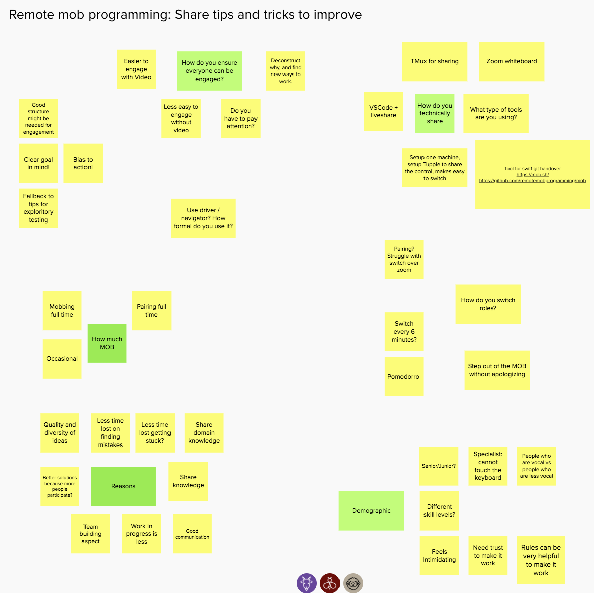

## What is SoCraTes?

I always heard good things about [SoCraTes](https://socratesuk.org/), a friend attended 4 times in a row to the SoCraTes UK version and told me it was his favourite event of the year. This is not the typical conference, in fact they define themselves as an unconference or retreat:

*International Software Craft and Testing Unconference UK
SoCraTes UK is a non-profit, international Software Crafters retreat for open-minded crafters who want to improve their craft and the software industry as a whole*

## Remote version

Due to COVID-19 the normal retreat was cancelled and an online version was held during last Friday, it was a good opportunity to attend and see how it worked. I have to admit I was really suprised by how well it was organized, I didn't have any problem knowing what was the schedule, the changes, how to switch room, it was fast and easy.

The tools used to make it work were:
- [Discord](https://discord.com/) for written communication. Some days before the workspace was created and some help provided if needed.
- [Zoom](https://zoom.us/) for video conferencing. There were several zoom rooms mapping to some rooms I imagine exist in the real house where the conference is usually held.
- [Mural](https://www.mural.co/) for sharing the schedule and then making diagrams, postits etc from each one of the talks.

They have a [Code of Conduct](https://socratesuk.org/code_of_conduct.html) that enforces a safe environment for everybody to participate.

I'm used to check the conference schedule of the ones I attend, what are the subjects they are going to talk and then decide where to go during the day. In SoCraTes it works totally different, the talks are dedided the very same day and they are not the expert talking and the others listening, is more a like a conversation, a collaboration between all the attendants, sharing their experience. Somebody says "I wanna talk about DDD and how we are struggling in our company". In fact, according to the organizers the best talks come from people asking open questions that they need help with. Example: "How can we improve in pair programming?"

## Learnings

I attended just two talks and both were related to the subject of remote pairing and **remote mob programming**. I'm [used to do pair programming](https://juan.pallares.me/remote-working-tips/) but working remotely has become harder to do it and as a result we do it less often than we would like. What was something new for me is mob programming, I just heard it once when the whole team was looking at one screen trying to solve a problem but I didn't know it was a thing.

I learned we do pair programming in a very loose way, which does not have to be bad but is good to know how the strict way is and what other people in the community is doing. I was suprised that some guys mentioned they were switching the keyboard every 3 minutes when they were collocated and that they always use the driver and navigator role.

I found confort in listening that we are not the only ones struggling with remote pairing. Everybody shared which tools were using for pairing, Liveshare, Teams, Zoom, Tuple but agreed that nothing is as good as being collocated.

Regarding mob programming, I learned a lot of teams are doing it daily. Imagine a big group (8 people?) working all together in the same code, only one writing (driver) one speaking (navigator) and the rest giving input when asked for, then rotating roles frequently. Very interesting topics were raised like, how can we ensure everybody is engaged? How often and for how long are you mobing? What are the reasons to use it? The main benefits are:
- Knowledge share accross whole team
- Less WIP
- Quality and diversity of ideas
- Less errors and less time finding them.

I find it like pair programming on steroids, all the benefits of pair programming multiplied.

Have you attended any remote conference recently? How was your experience?