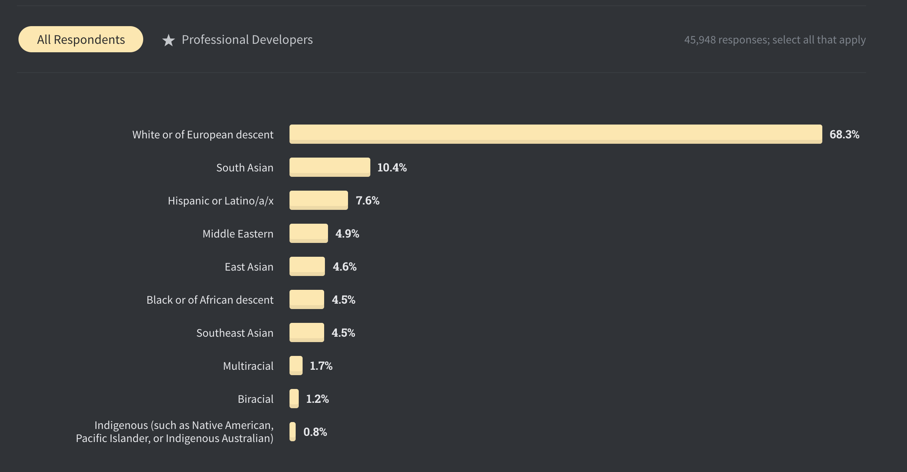

This last days going through my Twitter timeline was really shocking. I hated what I was watching and I couldn't stop watching it. How is it possible that in year 2020 in the most important country of the world, a reference for a lot of developing countries, a policeman can kill a man that is totally surredendered and saying that he can't breathe...

I honestly don't know what to do or say. I'm a white man, heterosexual, from a middle-class family in a developed country, tall (at least for Spanish standards) and even blonde with blue eyes (more on why this can be a privilege later). If you are phisically like me you should acknowledge how privileged we are, minorities are in clear disadvantage to us.

I believe this couple videos can explain much better what I try to say:
<iframe width="560" height="315" src="https://www.youtube.com/embed/4K5fbQ1-zps" frameborder="0" allow="accelerometer; autoplay; encrypted-media; gyroscope; picture-in-picture" allowfullscreen></iframe>

<iframe width="560" height="315" src="https://www.youtube.com/embed/Mqrhn8khGLM" frameborder="0" allow="accelerometer; autoplay; encrypted-media; gyroscope; picture-in-picture" allowfullscreen></iframe>

In the US, years of slavery and discrimination to black people create a gap that is really difficult to overcome, I believe this is one the reasons provoking  the recent events.

Why did I mention blonde and blue eyes before? What is standard of beauty (or has been until recent years)? white, blonde, straight hair, green/blue eyes. 
Think about it. Why are blue and green contact lenses sold? Why so many people dyes his hair blonde and straightens it? Only one very specific race is considered beautiful and the rest have to adapt! Check out the media, is changing I agree but some years ago it was impossible to a see a non-white actor with a leading role, even at latin american countries with most non-white population the TV was all white people, well sure you could have the black servants. This is a problem, you are placing a lot of people below by birth. Come on, even the band aids have the color of white skin! How come Jesus is so white being from the Midle-East? Last time I checked people over there were darker.

Going back to my environment, software engineers. Check out the results of the latest [Stackoverflow 2020 survey](https://insights.stackoverflow.com/survey/2020#developer-profile-gender-all-respondents2) released some days ago.

We have a long way to arrive to equality everywhere. We (white) have it really easy, just acknowledge it, as a first step.

## Police brutality

Something I don't want to miss is police brutality and the people that justifies it just because: *"Hey! they have been insulted and had objects thrown at them for hours, what would you do?!"*. I don't mind! They have to be able to put up with all of this and more, nothing justifies the atrocities seen in some videos. Somebody breaks the law? Just handcuff him and take him away. How can they be so violent with people just walking? It reminds me of recent events in Barcelona where we had also our take of police brutality. Again, I will quote someone that explains better what I mean:

<blockquote class="twitter-tweet">
I’m perplexed by the replies defending police actions because of some “other side” doing something.  If someone commits a crime, that doesn’t mean it’s okay for the police to start punching random peaceful people on the street. They don’t get to be “annoyed”, that’s their job.
&mdash; Dan Abramov (@dan_abramov) <a href="https://twitter.com/dan_abramov/status/1267151390578749441?ref_src=twsrc%5Etfw">May 31, 2020</a></blockquote> 

A couple movies I saw recently that can help understand the problem, both based in true stories:

[The Banker](https://www.imdb.com/title/tt6285944/) - In the 1960s two African-American entrepreneurs hire a working-class white man to pretend to be the head of their business empire while they pose as a janitor and chauffeur.

[Just Mercy](https://www.imdb.com/title/tt4916630/?ref_=tt_sims_tt) - World-renowned civil rights defense attorney Bryan Stevenson works to free a wrongly condemned death row prisoner.

Finally I want to send all my support and love to the protesters #BlackLivesMatter