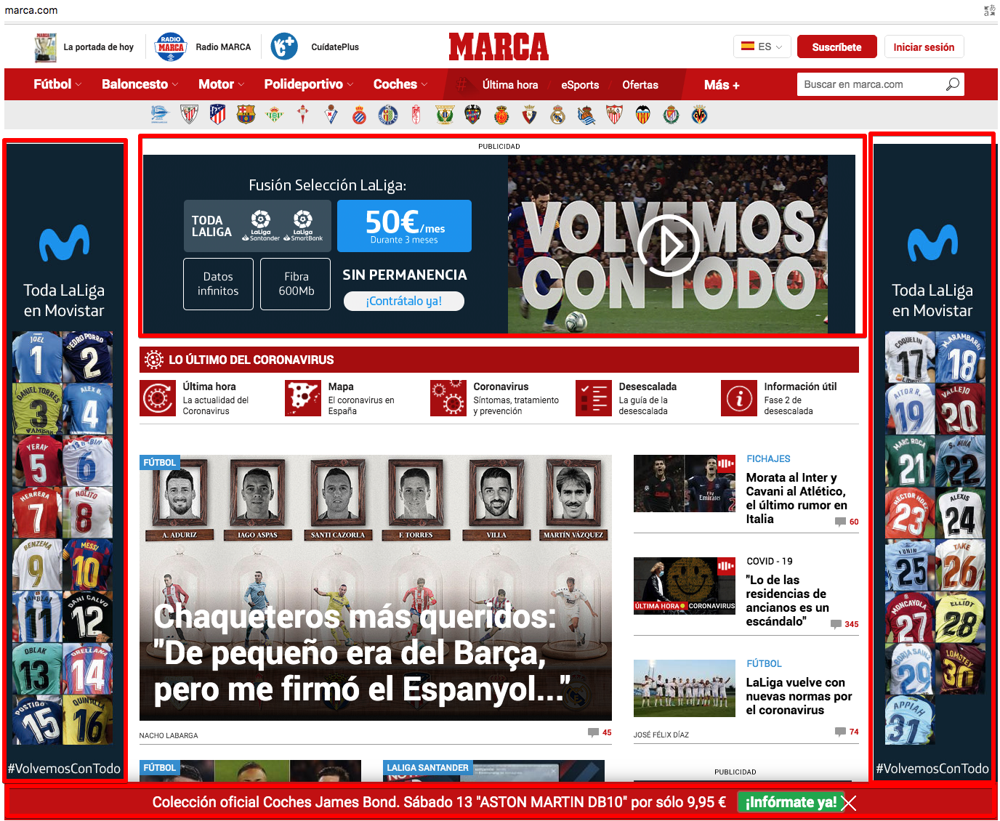
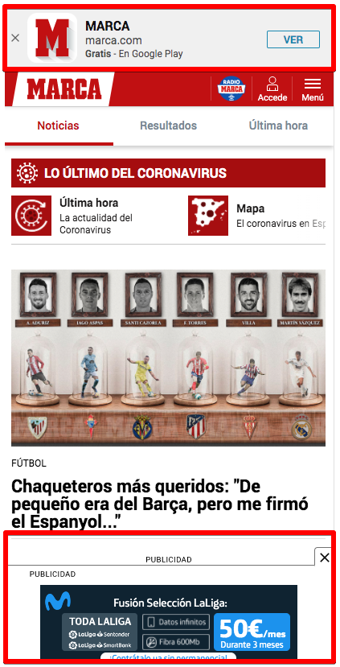

For the last months I have been using Brave as my browser for all my devices. The idea of having a Chrome fork that blocks ads and trackers seemed perfect. But Brave is not reliable at all:
- [The Brave web browser is hijacking links, and inserting affiliate codes](https://davidgerard.co.uk/blockchain/2020/06/06/the-brave-web-browser-is-hijacking-links-and-inserting-affiliate-codes/)

I am not directly affected since I don't use criptocurrency but a browser that markets itself like this: 

*It begins with giving you back power. Get unmatched speed, security and privacy by blocking trackers* 

Can not do this actions. The power to choose my affiliate code is taken away :unamused:.

Since [Chrome and all his tracking](https://clark.com/technology/google-chrome-do-not-track/) is a no-go. I looked for a browser that cared about privacy and could have Dashlane and uBlock add-ons installed and I decided to go back to [Mozilla Firefox](https://www.mozilla.org/es-ES/firefox). It was my browser years ago before Chrome arrived but before I continue let's see what happens when you don't block anything. 

# Ads

This is an sports website I usually visit with a browser that has no blocking configured:

Almost 50% of the website real-state are ads, apart from being annoying it also makes the loading slower and uses more data (concerning if you pay per MB like some data plans). If you are wondering if in a portable devices gets better, let me tell you it does not:

### Tablet:

### Phone:

I used this site because the ads are really big and painful and I have even seen full screen ad-popups with a blurry X to close.

# Trackers

Not only the ads should worry you, you are also being tracked, for example in the same page we have:

*"But Juan you are starting to be paranoid! Why do you worry about it? I don't have anything to hide"*. 

I also thought this way in the past, but once I read about the experience of an Egyptian guy during the Arab spring and how his "Facebook likes" were used against him and detained and sent to prison. Charge? Political dissidence. 

Let me quote this [The Guardian Article](https://www.theguardian.com/commentisfree/2013/feb/11/riot-software-tracked-online-social-networks). *Today, it's so easy that mass-surveillance is feasible – and so-called "big data" makes it seem tempting and innocuous.
The "big data" theory works like this: by grabbing hundreds or thousands of datapoints on millions of people, we build a systematic picture of how everyday people act. By analysing these by machine for "outliers", or suspicious activity, we can catch the bad guys – and it's OK, because only at that stage is another human being looking through your personal info.
**This is, by and large, fantasy. For one thing, any algorithm will generate hundreds if not thousands of false positives** (innocent people who hit a red flag). Given how rare, say, terrorism is, the vast majority of people bothered by these systems will be ordinary people facing previously unbelievable intrusion.*

Trust me, better to block as much as possible. There is an area between living in a mountain like a buddhist monk and browsing with no block at all, find it and start making more difficult for them to spy on you. I say "more difficult" because I want to emphasize, is impossible not being tracked, even if you did not have an smartphone and use only Internet only for work purposes, the people around you would do the tracking for you, for example with the photos you appear in.

# The solution

Here you have the same web with Firefox and the [uBlock Origin](https://addons.mozilla.org/en-US/firefox/addon/ublock-origin/) add-on.

It loads faster and you get to see just the real content and good news, Firefox and uBlock can also be installed in iOS and Android. You can specify how strictily Firefox should block tracking. Another step to prevent tracking is using [DuckDuckGo](https://duckduckgo.com/) as default search engine. It comes already as an option in Firefox.

# The next level

You want to go to the next level? What if I told about **network-wide ad blocking and faster browsing**? Meet [Pi-Hole](https://pi-hole.net/) .

[As I mentioned in the past](https://juan.pallares.me/raspberry-pi-hole-vpn/), if you have a Raspberry Pi lying around this is one of the best uses you can do of it. Is a very active project, they recently released the [v5.0](https://pi-hole.net/2020/05/10/pi-hole-v5-0-is-here/). For the screenshots with all the ads above I had to disable temporarily the PiHole apart from using Edge browser.

Are you blocking any ads? What is the browser you use? Don't tell me the google analytics script running on this page will tell me this and more :smirk:.
