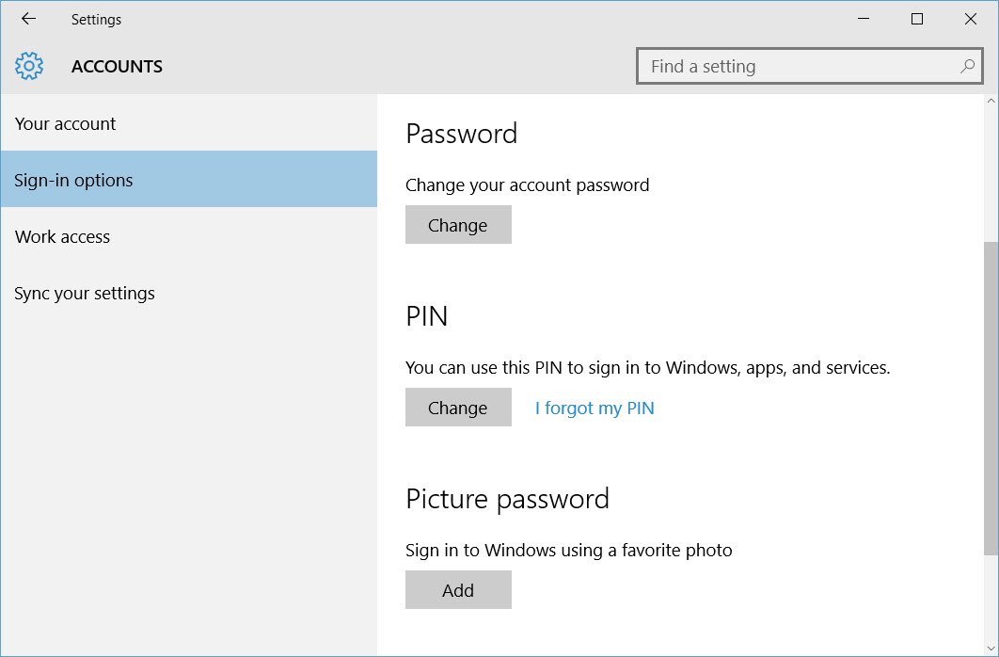

## TL;DR

1. Disable PIN login
2. Remote connect with user@domain.com and password
3. Renable PIN (I had to do it connected locally)
4. Remote connection will keep working with the previous credentials

## The problem

I have a PC machine working as a server with Windows 10 installed. I almost never use it phisically, I always remote to it. For remoting I use integrated authentication, this is my Microsoft account (usually an account ending in @live.com, @outlook.com or even @hotmail.com if you are old like me). This account has a very long and complicated password that [Dashlane](https://www.dashlane.com/) remembers for me.

If I loging phisically, I can't use Dashlane to get my password that's why I have enabled [PIN authentication](https://petri.com/windows-10-use-a-pin-instead-of-a-password-to-sign-in).

So what's the problem? **When you try to remote with a machine that has never remoted before it won't work**.

## The fix

This has happened me twice and both times I lost too much time googling the fix. I thought let's write a post about it so at least the third time I can look it here.

Let's be clear, **you don't want to remote with the PIN**. I believe is not possible but even if it was I wouldn't recommend it. So as I said in the quick steps in the TL;DR section, the trick is to disable temporarily the PIN. It seems it needs to remote login a first time with PIN disabled and then it will work afterwards.
