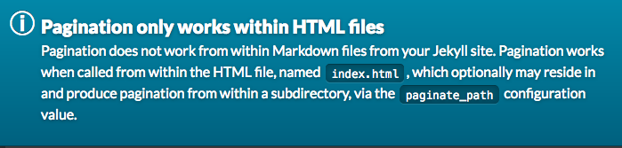
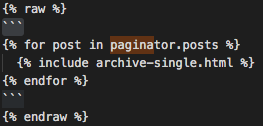

Almost 6 years ago I migrated from [Blogger to Jekyll + Github Pages](https://juan.pallares.me/moving-to-jekyll/) and I can't be happier with the change. Still, something I wanted long ago is to make it multi-language. I have entries in mind that I have not written because the clear target is Spain and the average English level in my country is not high. This last weekend I finally comitted to it and here I present my m̵a̵s̵t̵e̵r̵-̵p̵i̵e̵c̵e̵ quick-fix.

## Requirements

- **No plugins.** Github Pages is not compatible with many [plugins](https://pages.github.com/versions/). For example, I was unable to use [jekyll-multiple-languages-plugin](https://github.com/kurtsson/jekyll-multiple-languages-plugin)
- **Compatible with Minimal Mistakes**. My [Jekyll's theme](https://mmistakes.github.io/minimal-mistakes/) that I'm delighted with.
- **Show the entry if it is only in one language**. I have many old posts in Spanish or English that I will not translate, it has no value.
- **Link for language change in each entry**. If there are two languages ​​or more (I don't think I will ever write in Catalan or Italian :smile:) a link to change language ​​will be displayed.
- **Global Link language change**. This functionality has been dropped. The pagination plugin [jekyll-paginate](https://jekyllrb.com/docs/pagination/) does not allow more than one page. Sure there are ways to do it, but I did not want to spend the time, it did not compensate me.



## Implementation

Judging from Google's results, many warriors have gone but few have returned victorious. There is no standard way to do it and I have used what was best for my requrements from each site.

### Configure _config.yaml

In the _config.yml we set the language of the site adding the line `lang: en`. Then we create a file inside the `_data` folder, that I have called` i18n`, with the following content:
```
in:
  label: English
  icon: 🇬🇧
  read_it_in: "Read it in"
it is:
  label: Spanish
  icon: 🇪🇸
  read_it_in: "Read it on"
```

This will allow us to access content according to the language as we will see later.

### Adapt the [Front Matter](https://jekyllrb.com/docs/front-matter/) of the posts

In each post, specify your language `lang` and unique identifier` ref`.

```
-
title: RDP to Windows machine with PIN login
tags: [RDP, Windows, PIN, MicrosoftAccount, login, hacks]
excerpt: Don't lose the precious hour I lost
lang: in
ref: rdp
---
```

If two posts share the same `ref` they are the same post in different languages. I've seen people grouping the posts by folders according to the language, I have not considered it necessary.

### Filter by language

My main page is a pagination of all blog entries. Now we want all of them to be displayed, but if they are in more than one language, they should be shown in English.

Before it showed all the posts that came from the paginator:

```

  

```


Then what I have done is to group by the field `ref`. This way you can know if there is more than one language for each entry since the group will have more than 1 item. If that's the case, I take only the post that has the same language as the page (English in my case), otherwise I show the post regardless of the language:

```


    
        
    
        
    
    

```


That beautiful code is [Liquid](https://jekyllrb.com/docs/liquid/), it may already be in the TOP 5 of my most hated languages. Keep in mind that I do the identation for clarity, it is not necessary. In order to display Liquid code in Jekill (escape it) you have to use `raw`.



### Filter by language

In the previous code, `archive-single.html` is called and this is what we are going to edit now. We will add a flag emoji with the language in case there is a translation of the post.


```


    
        
            <a href="{{ version.url }}">{{site.data.i18n [version.lang] .icon}} </a>
        
    

```


It is again a similar concept to the previous one, the difference is that we now access the flag emoji that we put in the `_data/i18n.yml` file.

### Link to other languages ​​within the blog

And going from outside to inside, finally we have to edit `single.html` which is the `layout` of my blog entries. Add where you think is most appropriate:


```

    
    
        
            
                <a href="{{ version.url }}" class="{{ version.lang }}">{{ site.data.i18n[version.lang].read_it_in] }} {{ site.data.i18n[version.lang].icon }} </a>
            
        
    

```


In the first `if` I prevent other layouts from being affected and then practically the same. The difference is that I look for a different language than the current one and I show a text located next to the flag.

## Outcome

You are browsing on it right now. Feel free to swap between English and Spanish version. You can also see the [code on Github](https://github.com/jpallares/minimal-mistakes).

## Dodge the black hole

All engineers who have a blog/landing page suffer what I call the black hole. This is dedicating all the time to improve the blog technically, now I use Gatsby, now I deploy in Vercel, wow! now I have Github Actions ... but not writing any content. This multi-language update was the ideal breeding ground to start a technology change that would never have ended.


Luckily I clearly defined the minimum requirements and now I have a basic multi-language blog instead of a last-tech half-baked project. **Deliver value, that should be the focus**. It has helped me by forcing myself to a weekly blog post. What productivity-hacks do you have?