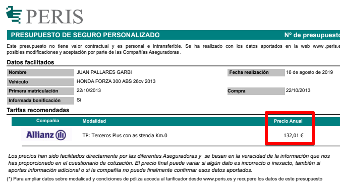

¿Cuánto pagas por tu seguro? Si no lo sabes, revísalo. ¿Y el año anterior? ¿Y el previo? Te ha ido subiendo cada año? No te preocupes, no estás solo. Las aseguradoras por lo general te suben el precio cada año aunque no tengas ningún parte. Aunque envejezcas y estadísticamente salgas de la franjas más peligrosas. Da lo mismo, el precio subirá igual que el sol sale cada mañana.

Por qué hacen esto? Opino que aprovechan varios factores:

- El seguro es obligatorio.
- La gente no tiene un gran control de sus finanzas y no notan esa subida. No se dan ni cuenta.
- El más importante. **Da pereza cambiar, igual que da pereza cambiar de banco, de compañía de teléfono, etc. Esto lo aprovechan sin piedad.**

## Mi caso

En 2010 compré una moto 125cc que venía con seguro incluído, otro truco ya que te tienen atado y no te sueltan por los anteriores motivos. Cuando pasó el primer año, renovado automáticamente por la nada despreciable cantidad de **242,05€** (no es que me acuerde, tengo el mail) con Allianz. Yo sabía que podía obtener el mismo seguro (terceros con asistencia) por **menos de 200€ y así fue**. Devolví el recibo y contacté con una correduría para que me buscaran el presupuesto más bajo y me dieran de baja de la otra aseguradora. Además todo por mail, llámame asocial o llámame práctico.

## La solución

Desde entonces, **un par de meses antes de que caduque el seguro tengo una alarma de Google Calendar CADUCA SEGURO** y en ese momento decido si quiero tragar este año con la subida o cambio de compañía? si decido cambiar envío un mensaje así a la correduría que he venido usando estos años: [Peris](https://www.peris.es/), en concreto a [correduria@peris.es y motos@peris.es](mailto:correduria@peris.es,motos@peris.es). Este es un ejemplo con mi actual moto, una 300cc:

```
Hola,

He gestionado varias veces el seguro con vosotros, soy Juan Pallarès Garbí con DNI XXXXXXXX y fecha de nacimiento 1985, 34 años en breve. Carné de conducir A2 con fecha de expedición XX/XX/XXXX (adjunto).

Mi moto es Honda Forza 300cc comprada en Octubre 2013 con matrícula XXXXXXX. Con permiso de circulación XXXXXXXXXXXXXXXXXXXX (adjunto) y también adjunto tarjeta inspección técnica.

Mi actual póliza es con Mapfre a terceros con asistencia en carretera. Número de póliza XXXXXXXXXXXXXX
Llevo dos años con ellos, cobrando los siguientes recibos
2017 - 141,07€
2018 - 150,93€
Esta póliza caduca a 23 de Octubre 2019.

Me puede pasar un listado de posible pólizas que pueda contratar?
Comuníqueme si falta algún dato o documento

Saludos
```

Fíjate en las subidas que se van produciendo y la próxima iba a ser 160€. Lo sé porque esta vez quise darles una oportunidad, llamé a Mapfre y les expliqué educadamente que o me bajaban el precio o me iba...da igual, seguían empecinados en que "han subido los costes". Llamé a otras aseguradoras, estilo Línea Directa, casi una hora al teléfono para ofrecerme algo más caro de lo que tenía. _"Por qué pensaste que habrían cambiado?"_ Me dije y volví a mi mail anual a Peris. Te responden con un mail donde adjuntan un presupuesto de este estilo:



132€ de coste, unos 30€ de ahorro.

## Vale la pena?

_"Como te pones Juan por 30€!"_ Que es como si os oyera decirme. Eso ha sido solo un año, imagina el Juan incauto del pasado que sigue con el seguro de 242€ que aumenta año tras año. Y además que si nos le dais valor a 30€ os paso mi número de cuenta que yo si les daré todo el amor que merecen :smile:.

Opino que vale la pena, ya no solo económicamente sino también para no sentir que te están tomando el pelo. Todo se puede gestionar por mail y es enviar un par de mail una vez al año. Se ha dado el caso que he estado en la aseguradora AXA, he ido a Mapfre y luego he vuelto AXA. AXA podría haberme tenido como cliente todo el tiempo si hubiera accedido a darme un precio de mercado, no lo hacen. También he estado estos años en Generali y Allianz, siempre al mejor postor, cúal mercenario.

Después de leer todo esto, seguirás con tu actual compañía? Me encantaría que compartieras tu experiencia conmigo.
