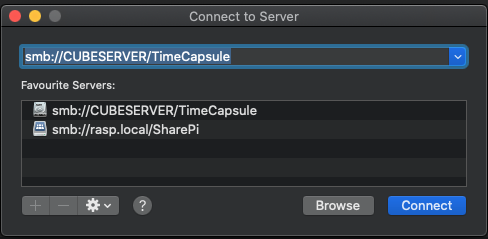
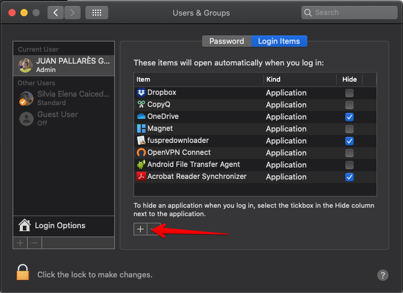
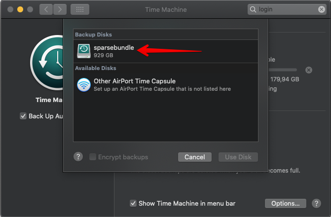
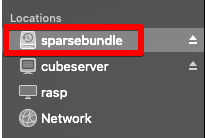

MacOS tiene un sistema de backup llamado [Time Machine](https://support.apple.com/es-es/HT201250) que funciona muy al estilo Apple, rápido y fácil pero siempre que tengas su hardware (Time Capsule) o un disco externo que tendrías que ir conectando. Si tienes un PC Windows a modo de servidor (como yo) y espacio libre, puedes utilizarlo como Time Capsule. El setup es un poco más difícil pero una vez hecho se harán las copias de seguridad en background mientras trabajas/procastinas tranquilo.

He utilizado [esta guía](https://www.imore.com/how-use-time-machine-backup-your-mac-windows-shared-folder) la cúal lo explica genial.

## 1 Crea una carpeta compartida en Windows como Time Capsule

Esto debería ser fácil y seguramente ya tienes alguna compartida. En tú máquina Windows selecciona la carpeta disco a compartir: `Botón derecho > Propiedades > Pestaña Compartir`. Recuerda darte permisos administrador a ti mismo. En mi caso he compartido un disco entero pero puedes compartir solo una carpeta dentro del disco si lo prefieres.

## 2 Conecta desde Mac a esta carpeta compartida

Desde el Finder: `Ir > Conecta a Servidor`. O más facil/pro `Cmd + K`. Como dirección debes poner `smb://servidor/carpeta`

Te pedirá usuario y contraseña y aquí pondras tus credenciales de Windows (justo las que les has dado permiso en el paso anterior). **Marca la opción de recordar y así no tendrás que volver a introducirlos**.

## 3 Crea una imagen sparsebundle

Esta imagen será del tipo HFS+ que es la que necesita Mac para usarla como backup.

1. Abre la Disk Utility y ve al menú `Archivo > Nueva Imagen > Imagen en Blanco`.
2. Renombrala como te parezca.
3. Escoge la carpeta compartida de Windows a la que te conectaste anteriorment como destino.
4. Renombra también el sparsebundle.
5. Escoge el tamaño, idealmente igual o más que el tamaño de disco de tu Mac.
6. **Valida que el tipo de Formato es Mac OS Extended (Journaled)**.

**Cuando grabes puede llegar a tardar horas en crear la imagen, dependiendo del tamaño**. Paciencia y déjalo trabajando. Quizá tenerlo conectado por red sea buena idea para acelerar el proceso.

## 4 Haz que se monte automáticamente

Para que cada vez que reinicies el disco se monte, tienes que configurarlo como Login Item, el único problema es que solo funcionará para tu usuario.

1. `Preferencias del Sistema > Usuarios y Grupos`.
1. Escoges tu usuario y entras a la pestaña Login Items.
1. **Añades la carpeta montada y el fichero.dmg** que hemos creado.

Esta parte me ha dado problemas, en cada login me pedía los credenciales aunque marcara que los guardara en KeyChain. Valida que no tengas varios logins sobre el mismo disco en KeyChain, cuando he eliminado duplicados me ha funcionado.

## 5 Configura TimeMachine para usar esa imagen

Por último, tenemos que comprobar que Time Machine puede ver esta imagen y usarla. En `Preferencias del Sistema > Time Machine` valida que la disco configurado es el sparsebundle que hemos creado.

Para poder añadirlo sino aparece, con el disco montado, ejecuta el comando:
`ls /Volumes`
y luego con el nombre de la imagen creada en el paso 3, en mi caso lo había nombrado sparsebundle, ejecuta:
`sudo tmutil setdestination /Volumes/sparsebundle`

Puede que también tengas que utilizar `sudo tmutil enable` si no tienes Time Machine activado.

## 6 Disfruta

La primera copia de seguridad será larga pero luego solo los archivos que han cambiado se guaradarán y todo se hará automáticamente en background.
