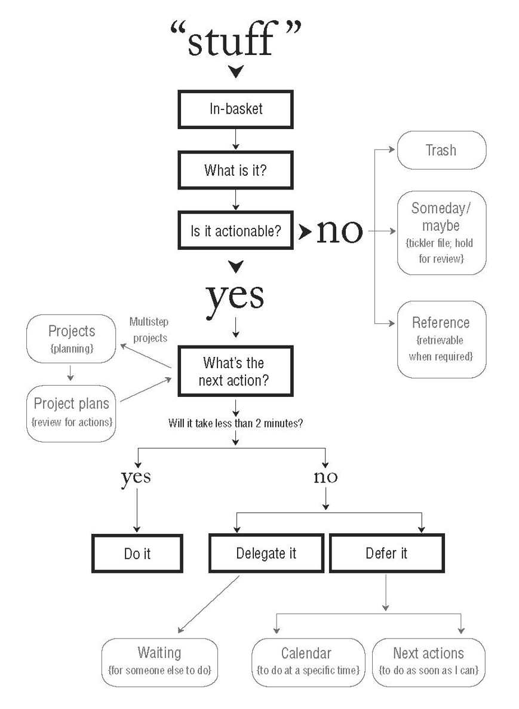

Do you have a TODO list? Have you ever used one? Do you remember that time you had so many things to do and the moment you wrote all down in a list you felt much more in control and relaxed? You can learn how to properly manage all your professional and personal life in the last book I read [Getting Things Done The Art of Stress-free Productivity by David Allen](https://www.amazon.es/Getting-Things-Done-Arts-Stresss/dp/0349408947/ref=sr_1_1?__mk_es_ES=%C3%85M%C3%85%C5%BD%C3%95%C3%91&dchild=1&keywords=getting+things+done&qid=1598698866&sr=8-1).

I have to admit, the book feels old. It talks a lot about filers (who uses that?), trays with physical documents, bills and a lot of hand-writing. Well, it was 1st published in 2001 and, even if I read a more modern edition, the feeling is there. Having said that, in my opinion, the main learnings are timeless and universal. I will quote a quote (Inception) from the book that explains this better: 
_As to methods there may be a million and then some, but principles are few. The man who grasps principles can successfully select his own methods. The man who tries methods, ignoring principles, is sure to have trouble._

I added the quotes I picked while reading in [this section](https://juan.pallares.me/books/getting-things-done/). Let me go in detail about the parts I liked more.

## Write everything down
This is the key concept of the book. Write down every task, idea, concept that crosses your mind and you feel can/could be important. Our brain is meant to have ideas not  to keep all these reminders there. It will generate stress. Implementing this tecnique you will have three benefits:
- Less stress.
- Being present. Not trying to remember what you wanted to do.
- Actually remembering things because they are written down.

## 5 steps. Capture - Clarify - Organize - Reflect - Engage

1. **Capture.**
As mentioned before, capture everything. While reading this post has your mind wandered off into something not related? maybe it's a pending task that you have not yet captured.
1. **Clarify.**
Is it really a task? What should be done?. At this moment you have more time to think about the tasks you captured.
1. **Organize.**
Notice in this step the task can evolve to project (multi-task), can be done at that moment (less than two minutes), can be delegated or postponed. 
1. **Reflect.**
This should be done at least once a week (weekly Review). Analyze all your pending tasks, projects, etc and refine them.
1. **Engage.**
Do the tasks at the moment they have to be done. Call the mechanic!

## Organize tasks depending on the context
The big secret to efficient creative and productive thinking and action is to put the right things in your focus at the right time. 
I loved the idea of organizing tasks depending on the context. Possible contexts:
- At the computer.
- At the phone.
- At the job.
- On a plane.
- Doing chores.
- Low energy.
- ...
Grouping them will help you tackle more in less time and increase focus.

## What is the next action?
Often tasks get stuck because they are too vague. Can you spot the difference between "Fix car" and "Call XXXX to make an appointment to fix car tires"?.  It's ok to add tasks/ideas in the capture phase a little bit vague. But once they are refined they should be clear actionable tasks.
The question forces clarity, accountability, productivity, and empowerment. 
This can be applied to meetings too. Once a meeting is coming to an end, "What's the next action?" is a powerful question.

## Technology double-sided sword
Technology sure can help keep track on all information. But it's so easy to use that it can evolve in what the author calls "write-only syndrome":
_All they’re doing is capturing information—not actually accessing and using it intelligently. Some consciousness needs to be applied to keep one’s potentially huge digital library functional, versus a black hole of data easily dumped in there with a couple of keystrokes._

## Conclusion
Don't feel overwhelmed with all the techniques. Applying just some parts is already a victory and a productivity improvement. I started using [Todoist](https://todoist.com/) and created some projects, tags depending on the context and filters to see tasks in the order and prioriy I want. I'm still far from being a pro GTDer but I'm liking it so far. David Allen recommends reading the book again or at least skimming through it after some time promising it will feel like a new book. I'll sure try in a year or two. Are you using GTD methodology? Any recommended tools/experience?