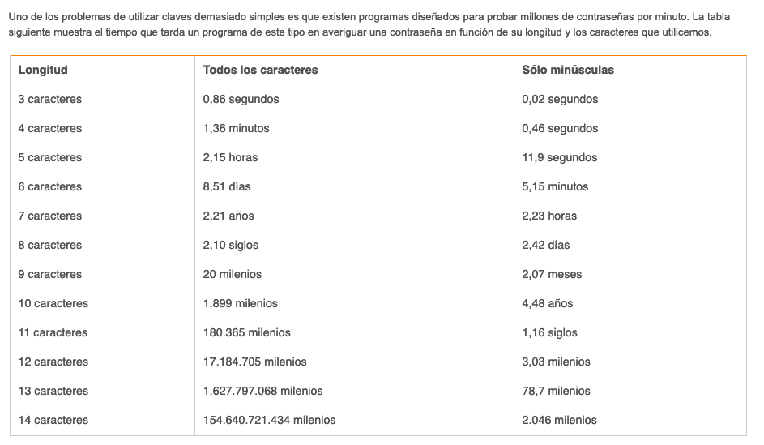
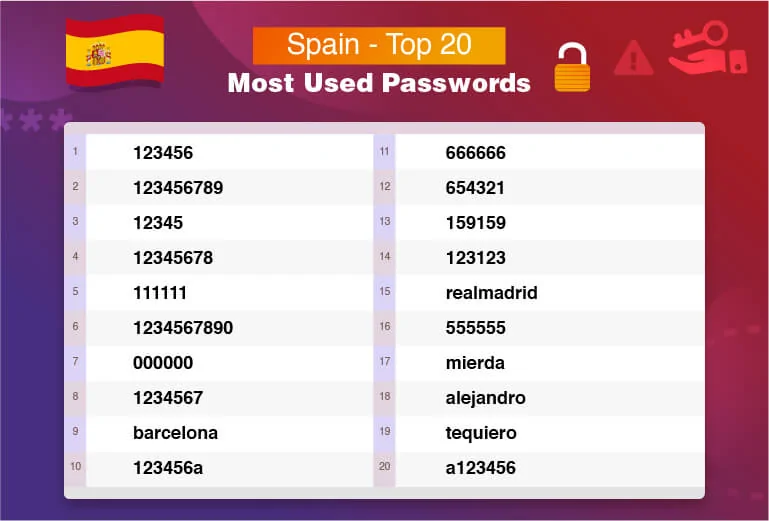

## Problema

Es muy común tener una o dos contraseñas para todo. Para el mail, para Netflix, para Amazon, para el usuario del ordenador. Incluso algunos se vienen arriba y usan la misma contraseña pero van cambiando algo al final, indetectable! deben pensar. Cuando avisas que eso es muy poco seguro la respuesta es:

- Pero si tengo muchas se me olvidan!

Estoy de acuerdo, son díficiles de recordar tantas contraseñas y más cuando nos piden que tengan números, símbolos, mayúsculas, sangre de uniconrnio, etc. Y no hablemos de los [CAPTCHA](https://es.wikipedia.org/wiki/Captcha).

El problema con reutilizar la contraseña es muy sencillo de entender. Imagina esta situación:

- Hace mucho tiempo te registraste en "foro pepito" para preguntar algo, te contestaron y ya nunca más volviste a entrar.
- Al cabo de un tiempo, un ataque consigue las contraseñas de todos los usuarios de "foro pepito". A "foro pepito" nunca le preocupó la seguridad de sus usuarios.
- En el registro del foro piden email, por lo que lo hackers lo siguiente que hacen es intentar entrar en todos las cuentas más famosas con ese correo y contraseña robada.
- Ya has perdido todas las cuentas que compartían contraseña. Si solo cambias un número al final o algo muy obvio, es muy probable que también lo prueben.

## Solución

Posiblemente pienses que con guardar las contraseñas en el navegador es suficiente, pero no es un método igual de seguro. Además, solo estarán en un dispositivo, te tocará escribirlas en el móvil o en otro ordenador.

**Usa un gestor de contraseñas**. Tendrás que acordate de una sola contraseña y el resto las puedes autogenerar largas y complicadas porque no tendrás que escribirlas, el gestor lo hará por ti. No sabes lo cómodo que se convierte navegar hasta que lo usas. En el móvil además si tienes lector de huellas es una gozada.

Además, los hay gratuítos y que funcionan muy bien. En mi caso, estoy usando [Bitwarden](https://bitwarden.com/). Lo tengo instalado en todos mis dispositivos, se sincroniza, me autorellena usuario y contraseña de las páginas y tiene generador de contraseñas.
He probado varios más (Lastpass, 1password...). Usé [Dashlane](https://www.dashlane.com/) durante dos años y es francamente mejor que Bitwarden, pero se paga. Te notifica cuando ha habido ataques en paginas donde tu tienes cuenta, tiene VPN y se integra mejor con los navegadores. Además estan ganando tanta fuerza que hicieron el famoso anuncio de la Superbowl.

<iframe width="560" height="315" src="https://www.youtube.com/embed/B5lslSPfhkg" frameborder="0" allow="accelerometer; autoplay; encrypted-media; gyroscope; picture-in-picture" allowfullscreen></iframe>

Mi sugerencia, prueba con uno gratuíto y si ves que con el tiempo se te queda pequeño, haz el upgrade. Todos suelen permitir exportar y importar todos los datos para cambiar fácilmente de gestor.

## Cómo es una buena contraseña

**LARGA**, conforme más larga, más segura. Por ejemplo, MiPerroTobyLadraMucho es muchísimo más segura que S0yH4cker.

Y, por favor, no uses tu cumpleaños, tu nombre, tu DNI o otros datos que se pueden obtener fácilmente. Tampoco uses las que usa todo el mundo:

[Fuente](https://www.safetydetectives.com/blog/the-most-hacked-passwords-in-the-world/) y [Fuente](https://www.osi.es/es/contrasenas)
