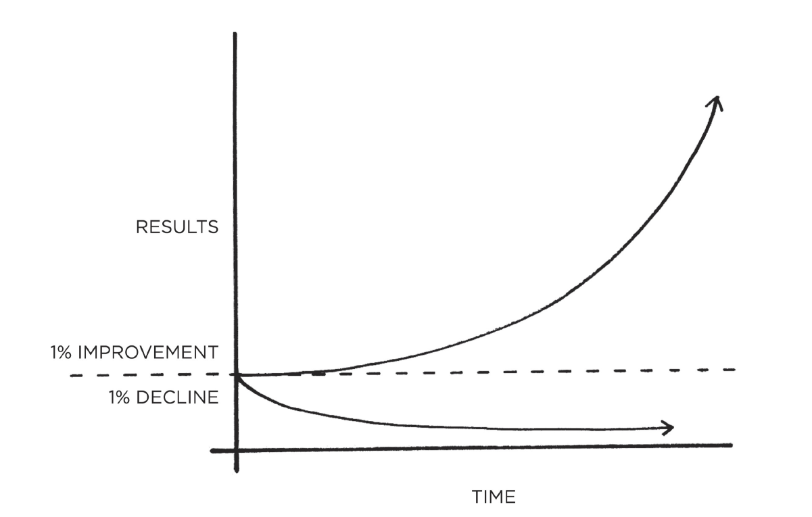
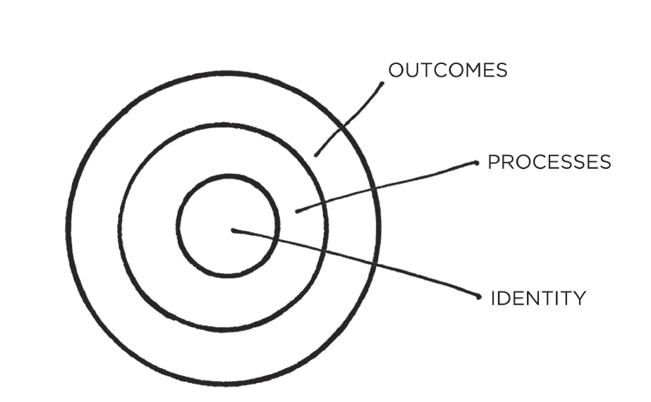

This is a book that even if most things that are mentioned can be obvious I couldn't stop highlighting interesting quotes. It took me a month to read but could have been a week or days. It starts every chapter with an story that captures your attention and is used as an example of the concept that is going to be explained. Every chapter is closed with a summary, something my engineer/order freak mind loves.

## Compound interest

The Compound Interest concepts is mainly used in economic terms, [when investing long-term](http://pallares.me/why-i-became-a-bogglehead/) is one of the keys for having great benefits. But the concept can be applied to almost everything and in the book it is applied to self-improvement acquiring good habits. That's why with tiny changes you get remarkable results.

## Cue -> Craving -> Response -> Reward

The cue is about noticing the reward. The craving is about wanting the reward. The response is about obtaining the reward. We chase rewards because they serve two purposes: (1) they satisfy us and (2) they teach us.

You get what you repeat

Changing our habits is challenging for two reasons: (1) we try to change the wrong thing and (2) we try to change our habits in the wrong way.

If you want better results, then forget about setting goals. Focus on your system instead.

The alternative is to build identity-based habits. With this approach, we start by focusing on who we wish to become.

Outcomes are about what you get. Processes are about what you do. Identity is about what you believe

t’s important to let your values, principles, and identity drive the loop rather than your results. The focus should always be on becoming that type of person, not getting a particular outcome

## 4 Laws

- Make it obvious.
- Make it attractive.
- Make it easy.
- Make it satisfying.

TODO EL ESQUEMA!!! y luego explicar

## Techniches for building habits tiene sentido explicarlas?

- Habit stacking
- Context, one space, one use. Is easier to build new habits in a new environment because you are not fighting against old cues.

- Temptation bundling
- Peer pressure, join groups of people with habits you want to create
- Two-minute rule

## No freedom? Will I become a robot?

Such questions set up a false dichotomy. They make you think that you have to choose between building habits and attaining freedom. In reality, the two complement each other. Habits do not restrict freedom. They create it. In fact, the people who don’t have their habits handled are often the ones with the least amount of freedom. Without good financial habits, you will always be struggling for the next dollar. Without good health habits, you will always seem to be short on energy. Without good learning habits, you will always feel like you’re behind the curve

## Tremendous self-control?

When scientists analyze people who appear to have tremendous self-control, it turns out those individuals aren’t all that different from those who are struggling. Instead, “disciplined” people are better at structuring their lives in a way that does not require heroic willpower and self-control. In other words, they spend less time in tempting situations.

## GTD related

Many people think they lack motivation when what they really lack is clarity.

make decisions about simple tasks—when should I work out, where do I go to write, when do I pay the bills—then you have less time for freedom.

We often say yes to little requests because we are not clear enough about what we need to be doing instead.

## analisis paralisis

This is the first takeaway of the 3rd Law: you just need to get your reps in.

It is easy to get bogged down trying to find the optimal plan for change: the fastest way to lose weight, the best program to build muscle, the perfect idea for a side hustle. We are so focused on figuring out the best approach that we never get around to taking action. As Voltaire once wrote, “The best is the enemy of the good.”

# Tracking

reduce the friction associated with our good habits and increase the friction associated with our bad ones.
Cardinal Rule of Behavior Change: What is rewarded is repeated. What is punished is avoided. You learn what to do in the future based on what you were rewarded for doing (or punished for doing) in the past. Positive emotions cultivate habits. Negative emotions destroy them.
add a little bit of immediate pleasure to the habits that pay off in the long-run and a little bit of immediate pain to ones that don’t.

## Personal experiences

Already did some stuff like gym clothes

Social media removed from phone

## Quiting bad Habits

-

_Think of the world as a premature baby in an incubator. The baby’s health status is extremely bad and her breathing, heart rate, and other important signs are tracked constantly so that changes for better or worse can quickly be seen. After a week, she is getting a lot better. On all the main measures, she is improving, but she still has to stay in the incubator because her health is still critical. Does it make sense to say that the infant’s situation is improving? Yes. Absolutely. Does it make sense to say it is bad? Yes, absolutely. Does saying “things are improving” imply that everything is fine, and we should all relax and not worry? No, not at all. Is it helpful to have to choose between bad and improving? Definitely not. It’s both. It’s both bad and better. Better, and bad, at the same time._

<iframe src="https://giphy.com/embed/26tknCqiJrBQG6bxC" width="100%" height="100%" style="position:absolute" frameBorder="0" class="giphy-embed" allowFullScreen></iframe>

<a href="https://giphy.com/gifs/election2016-election-2016-presidential-debate-26tknCqiJrBQG6bxC">via GIPHY</a>

## Conclusion

Easy to read. Interesting, funny, and revealing experiences from the author around the world. Great summaries after every chapter. Do you love data? 100% recommended. Better to read it in a tablet than in a e-reader because of the graphics.
