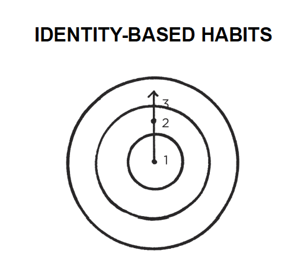

2021 is starting soon and with it the usual new year resolutions. _I'm going to eat healthier_. _I'm going to the gym this year for sure!_. Once March arrives no resolution has survived. Why is it so difficult to create healthy habits? New habits in general?

[Atomic Habits](https://www.amazon.es/Atomic-Habits-Proven-Build-Break/dp/1847941834) is the answer. A book that even if most things that are mentioned can be obvious I couldn't stop highlighting interesting quotes. It took me a month to read but could have been days. It starts every chapter with a story that captures your attention and it is used as an example of the concept that is going to be explained and then closed with a summary, something my engineer/order freak mind loves.

## Compound interest

The Compound Interest concept is mainly used in economic terms, [when investing long-term](http://pallares.me/why-i-became-a-bogglehead/) is one of the keys for having great benefits. But the concept can be applied to almost everything and in this book it's applied to self-improvement, acquiring good habits. That's why with tiny changes you get remarkable results.

## Cue -> Craving -> Response -> Reward

There are 4 steps involved in any habit:

- The **cue** is about **noticing** the reward.
- The **craving** is about **wanting** the reward.
- The **response** is about **obtaining** the reward.
- We chase **rewards** because they serve two purposes: (1) they **satisfy** us and (2) they **teach** us.

To improve the way we manage habits, we need to work with these 4 steps.

## Why is it so difficult to change our habits?

Changing our habits is challenging for two reasons: (1) we try to change the wrong thing and (2) we try to change our habits in the wrong way. If you want better results, then forget about setting goals. Focus on your system instead. Focus on your identity.

Outcomes are about what you get. Processes are about what you do. Identity is about what you believe. We usually say, _"I'll do sport every day"_ instead it should be _"I'm a fit person"_. The focus is who we wish to become.

Instead of acting from the outside to the inside. We have to create our identity and it will change the outer layers.

Once we have an identity, it will be very conflicting for us to act against it.

## How to create a Good Habit - 4 Laws of behavioral change

For creating a good habit, we have to use the 4 Laws of behavioral change.
**Make it obvious, attractive, easy and satisfying.**

Why?

_Cardinal Rule of Behavior Change: What is rewarded is repeated. What is punished is avoided. You learn what to do in the future based on what you were rewarded for doing (or punished for doing) in the past. Positive emotions cultivate habits. Negative emotions destroy them._

_Add a little bit of immediate pleasure to the habits that pay off in the long-run and a little bit of immediate pain to ones that don’t._

Here I'm going to copy-paste the final version of the summary that James Clear creates after every chapter.

- 1st Law: Make it **obvious**.
  - 1.1 Fill out the [**Habits Scorecard**](https://s3.amazonaws.com/jamesclear/Atomic+Habits/The+Habits+Scorecard.pdf). Write down your current habits to become aware of them.
  - 1.2 Use **implementation intentions**: “I will [BEHAVIOR] at [TIME] in [LOCATION].”
  - 1.3 Use **habit stacking**: “After [CURRENT HABIT], I will [NEW HABIT].”
  - 1.4 Design your **environment**. Make the cues of good habits obvious and visible.
- 2nd Law: Make it **attractive**.
  - 2.1 Use **temptation bundling**. Pair an action you want to do with an action you need to do.
  - 2.2 Join a **culture** where your desired behavior is the normal behavior.
  - 2.3 Create a **motivation ritual**. Do something you enjoy immediately before a difficult habit.
- 3rd Law: Make it **easy**.
  - 3.1 **Reduce friction**. Decrease the number of steps between you and your good habits.
  - 3.2 Prime the **environment**. Prepare your environment to make future actions easier.
  - 3.3 **Master the decisive moment**. Optimize the small choices that deliver outsized impact.
  - 3.4 Use the **Two-Minute Rule**. Downscale your habits until they can be done in two minutes or less.
  - 3.5 **Automate** your habits. Invest in technology and onetime purchases that lock in future behavior.
- 4th Law: Make it **satisfying**.
  - 4.1 Use **reinforcement**. Give yourself an immediate reward when you complete your habit.
  - 4.2 Make “doing nothing” enjoyable. When avoiding a bad habit, design a way to see the benefits.
  - 4.3 Use a **habit tracker**. Keep track of your habit streak and “don’t break the chain.”.
  - 4.4 **Never miss twice**. When you forget to do a habit, make sure you get back on track immediately.

Over the book, it goes over all these laws and explains with examples how to do it and why it's useful.

## Quitting bad Habits

It also explains how to quit bad habits, as you guessed is doing the opposite actions you do for acquiring good habits.

- Inversion of the 1st Law: Make it **invisible**.
  - 1.5 **Reduce exposure**. Remove the cues of your bad habits from your environment.
- Inversion of the 2nd Law: Make it **unattractive**.
  - 2.4 **Reframe your mind-set**. Highlight the benefits of avoiding your bad habits.
- Inversion of the 3rd Law: Make it **difficult**.
  - 3.6 **Increase friction**. Increase the number of steps between you and your bad habits.
  - 3.7 Use a **commitment device**. Restrict your future choices to the ones that benefit you.
- Inversion of the 4th Law: Make it **unsatisfying**.
  - 4.5 Get an **accountability partner**. Ask someone to watch your behavior.
  - 4.6 Create a **habit contract**. Make the costs of your bad habits public and painful.

## Powerful concepts

Now I'm gonna go over some quotes that I liked specially from the book. [Find all the quotes here](https://juan.pallares.me/books/atomic-habits-tiny-changes-remarkable-results/).

### No freedom? Will I become a robot?

Some people can be concerned with all these habits, it seems to be too much planning, no room for improvising? being original?:

_Such questions set up a false dichotomy. They make you think that you have to choose between building habits and attaining freedom. In reality, the two complement each other. Habits do not restrict freedom. They create it. In fact, the people who don’t have their habits handled are often the ones with the least amount of freedom. Without good financial habits, you will always be struggling for the next dollar. Without good health habits, you will always seem to be short on energy. Without good learning habits, you will always feel like you’re behind the curve._

### Tremendous self-control or less temptations

I never have pastries, ice-cream or other sugar-added foods at home, why? if they are there I can't resist eating them for long. I try to be the less time possible in tempting situations:

_When scientists analyze people who appear to have tremendous self-control, it turns out those individuals aren’t all that different from those who are struggling. Instead, “disciplined” people are better at structuring their lives in a way that does not require heroic willpower and self-control. In other words, they spend less time in tempting situations._

### Similar concepts to GTD

I recently read the [Getting Things Done book]() and I found some ideas linked from both books. One of the benefits of GTD is getting clarity, you know what to do next, in Atomic Habits is mentioned that many people believe they lack motivation when what they really lack is clarity. For example, making decisions about simple tasks like when should I work out, where do I go to write, when do I pay the bills provokes that you have less time for freedom. Also, we often say yes to little requests because we are not clear enough about what we need to be doing instead.

Another similar concept is doing it perfectly or not doing it. I also consider it "Analysis paralysis". Both books enforce starting simple and get better with time. In the habits world, it's really important to accumulate reps, the more you do the more you forge your identity.

_It is easy to get bogged down trying to find the optimal plan for change: the fastest way to lose weight, the best program to build muscle, the perfect idea for a side hustle. We are so focused on figuring out the best approach that we never get around to taking action. As Voltaire once wrote, “The best is the enemy of the good.”_

## Personal experience

I already did some of the actions suggested. I usually go to the gym in the early morning and I tend to leave everything ready (clothes, bag, etc.) the night before so there is no friction/excuses in the morning. I tend to plan my training routine, so there is commitment and clarity, I avoid the "What should I do now?". I also followed the rule of "Never miss twice" even without knowing about it. I'm known by my friends as a gym rat so I guess it's my identity already.

I also limit myself to one chapter per day from Netflix (this one is hard) or read for at least 30 minutes before sleeping, trying to increase the time and situations for reading, but step by step.
Even this blog post you are reading is part of a new habit I'm trying to build. ~~I want to write often~~ I want to be a writer.

Something I tried to implement is using less social media. I used to go over Instagram and Twitter feeds too often. It was super easy having it on the phone ready to be checked and opened and also with the notification in case you happen to ignore it for some time. I discovered myself at the toilet checking the phone while brushing my teeth, that can't be right. Hardcore solution, deleting both apps from the phone. Having them only on the iPad made it uncomfortable and I checked it once or twice per day. After some days like that, I evolved to use the web version of both apps, which are more slow and difficult to use (there is still friction) and I use them less frequently than before but I can use them when I'm away from the iPad. Something positive of Instagram web version, no ads :).

Another bad habits on my radar:

- The way I sit down which is clearly wrong and created back pain.
- Eating super fast.

I'll try to use the learnings of the book to improve there. What is your experience with habits/resolutions? What would you like to start/stop doing?
