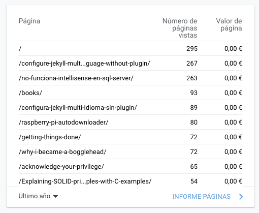
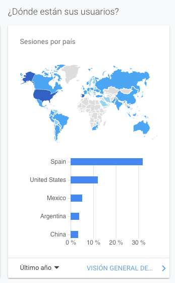

## Mirando el lado positivo

Es común reflexionar al final del año de como ha ido todo, hacer un balance. Por lo general, con la pandemia ha sido un año horroroso pero aún así hay que intentar sacar siempre lo positivo. Ahí van algunas reflexiones aleatorias:

- Soy más social de lo que me pensaba, el confinamiento y el trabajo remoto me ha hecho extrañar mucho la oficina y las relaciones sociales que se crean allí.
- Por otro lado, cuando te vas adaptando y no estas confinado, el trabajo remoto da mucha flexibilidad y lo empiezas a apreciar/disfrutar.
- Me cuesta una barbaridad entrenar en casa. El tipo de entremientos que me gustan son estilo crossfit o directamente barra y kg. Sin pesos y con la única compañia de la pareja y/o vecino ha sido difícil. Aún así he seguido entrenando y trackeando el progreso. Además he probado el plan de entrenamiento 5/3/1 y lo he incorporado junto al crossfit.
- Empecé este año a invertir de forma indexada, justo un año que la economía se ha hundido pero por suerte he acabado con un 10% de rentabilidad, nada mal. Ya dedicaré un post a esto y las causas principales, seguramente cuando haga el rebalanceo anual.
- He vuelto a adquirir el hábito de la lectura, [varios libros leídos](https://juan.pallares.me/books/) más uno in progress (no hago una entrada sobre todos).
- También he vuelto a escribir en este blog. 17 nuevas entradas este año, empezando en abril. Sin target claro, temas variadísimos, la única meta: escribir con frecuencia.
- Es obvio pero no deja de sorpredener la cantidad de dinero ahorrado cuando no puedes salir de casa y el único gasto es comer. Ayuda a poner en perspectiva la importancia de según que gastos.

## Las entradas más vistas

No tengo ningún objetivo definido a nivel de número de visitas, tráfico del blog, etc. pero si me gusta mirar estadísticas. Vamos a repasar los reports de Google Analytics:

Aparte de la pagina principal, las dos entrada más visitadas en 2020 son:

1. [Configure Jekyll to be multi-language without plugins](https://juan.pallares.me/configure-jekyll-multi-language-without-plugin/) y su [version en castellano](https://juan.pallares.me/configura-jekyll-multi-idioma-sin-plugin/) es la cuarta. Esto me lo podía medio imaginar, no hay una forma fácil/clara de hacer jekyll multidioma y mucha gente interesada en hacerlo.
2. [No funciona Intellisense en SQL Server Management Studio 2008](https://juan.pallares.me/no-funciona-intellisense-en-sql-server/). Esta si que sorprende más. **Es una entrada del 2012!** y [la migré del antiguo blog en Blogger](https://juan.pallares.me/moving-to-jekyll/) de casualidad. Obviamente las visitas llegan todas via Google (nadie llega a las quinta página) y deduzco que la causa de tantas visitas es que el título tiene muy buen SEO y es un problema que necesita solución aún en 2020. Nunca imaginé que una entrada tan chorra estaría como la segunda más visitada.
3. Si ignoramos books, que es un apartado más que una entrada llegamos a [Raspberry Pi autodownloader](https://juan.pallares.me/raspberry-pi-autodownloader/). Esta entrada con mejor título sería más visitada seguramente pero bueno aún así tiene el tercer puesto siendo una entrada de 2017.

## Desde donde llegan las visitas

Suelo poner un link a cada nueva entrada en Twitter y en LinkedIn. Aún así, la mayoría de visitas vienen via organic search, es decir, búsquedas en Google.

Por último, como curiosidad, parece que la inmensa mayoría de visitas vienen de España seguidos por USA. Un saludo para los lectores chinos! 🤣

