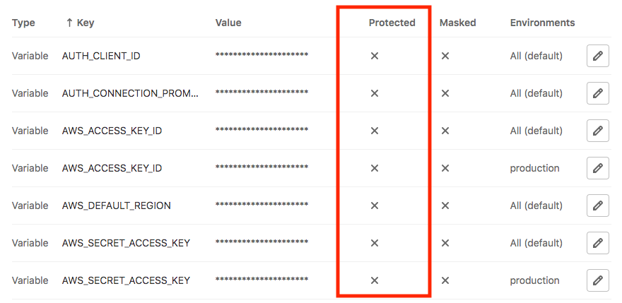
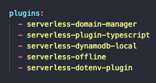
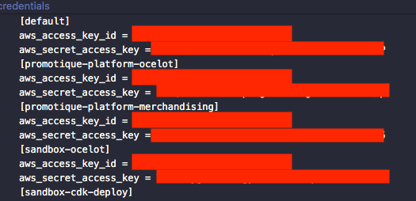

At my job, we have had recurring issues with [serverless](https://www.serverless.com/) that have slowed down us frequently. This guide aims to avoid that by compiling the main pain points we have experienced. Keep in mind we use AWS and Gitlab.

## Avoid gitlab protected variables

When configuring Serverless to be deployed from Gitlab CI/CD. **Remember to not set AWS env variables as protected** (default option) since it will make the deployment fail and **it won’t give you a meaningful error**.



## Serverless offline plugins order is important

Plugins order in serverless.yml matters. Rule of thumb, **serverless offline should be always one of the latest**.



## Serverless custom domain

To configure the deployment to sandbox and to production AWS in custom domain you can use the plugin [serverless-domain-manager](https://www.npmjs.com/package/serverless-domain-manager). **Keep in mind, before being able to deploy you have to call (only once per domain)**:

`sls create_domain --aws-profile LAT-serverless-cheetah-bff --stage production`

The key point is specifying the stage when deploying.

`serverless deploy --stage staging`

## Using AWS credentials locally

Check the file in ~/.aws. There you should configure different credentials depending on the IAM user/AWS account. If no profile is called, the default will be used.



Then later you can use them like this:

`sls deploy --stage production --aws-profile LAT-serverless-cheetah-bff`

## Serverless DynamoDB Locally

Two plugins are needed [serverless-dynamodb-local](https://github.com/99x/serverless-dynamodb-local) and [serverless-dynamodb-client](https://www.npmjs.com/package/serverless-dynamodb-client).
**After installing the packages the normal way. You have to install it to serverless**:

`sls dynamodb install`

Then to make it work we used to terminals. In one we run `sls dynamodb start --migrate`, in the second one we run `sls offline`.

## Serverless Dotenv - Environment variables

To use environment variables locally, **do not use dotenv package**. Use [serverless-dotenv-plugin](https://www.serverless.com/plugins/serverless-dotenv-plugin).

## Import issues - Failure: xxxxxx.default is not a constructor

The only way we could fix this issue was doing require instead of import. Most probably an issue with not properly configured `tsconfig.json`.

For the problematic imports use:

`const pLimit = require('p-limit');`

instead of

`import pLimit from 'p-limit';`

## Include JSON files in build

If using typescript and JSON files, you will need to include this files so they are copied to the `.build` folder in the `serverless.yml` file:

```
package:
    include:
        - localizations/\*.json
```

Have you experienced any other issue? My main concern is that the errors messages are not clear enough.
