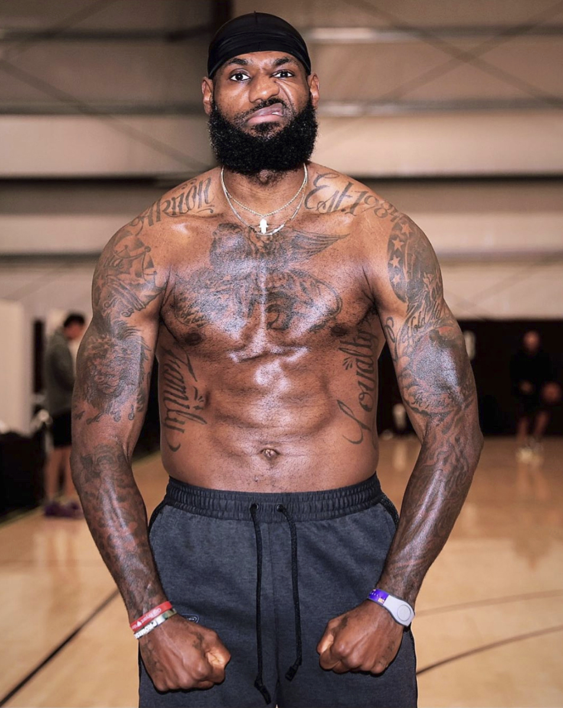
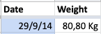
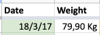
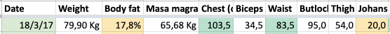

Con 2,06m y 113kg, el IMC (Índice de Masa Corporal) del cuatro veces campeón de la NBA indica que tiene sobrepeso. Personalmente no le veo sobrepeso por ningún sitio, sobrepeso de éxitos deportivos si me apuras.

En todas las revisiones de salud anuales típicas del trabajo me han dado el valor de IMC. ¿Veis esta medida creíble? ¿Útil? Para mi es demasiado general y puede llegar a confundirte en algunos casos. Después de esta introducción que coquetea con el clickbait, voy a explicar cómo creo que es mejor medir la evolución física.

## No quieres bajar peso, quieres bajar grasa

Es muy común pesarse y si se va bajando de peso asumir que estamos en el buen camino. Grave error. **Te interesa perder grasa pero no músculo**, o al menos perder el mínimo posible. Si haces un dieta estricta con poca proteína y casi sin entrenar fuerza es la receta perfecta para perder mucho músculo y grasa. Además el músculo es muy fácil perderlo, es caro de mantener. Tu cuerpo si nota que no lo usas te lo quita. La grasa tarda mucho más en irse, son tus reservas en caso de ausencia de comida, no las cosumirá hasta que le obligues de verdad.

Esto lo se porque lo he experimentado yo mismo. Desde el 2014 me voy pesando semanalmente (hay temporadas que se me pasa pero en general lo hago) y fué ese primer año que bajé bastante de peso y para mi era un exitazo

3 años después si solo me fijo en el peso estoy igual. Pero realmente estaba en un estado de forma mucho mejor, ¿cómo puedo saberlo?

## Como mido la grasa?

**Medir la grasa de forma precisa es bastante difícil**. Las básculas que dan el porcentaje de grasa tienen mucho margen de error, es solo una aproximación. Puedes probar también con un adipómetro pero es un proceso tedioso y también poco preciso. Hay formas precisa de medirla pero es con máquinas especializadas y por un elevador precio. ¿Qué uso yo? algo mucho más sencillo, **mido la cintura a la altura del ombligo y el pecho a la altura del pezón**. Ya esta, eso es todo. Acumulamos mucha grasa en el abdomen, si tenemos menos cintura que pecho, estamos en la buena dirección. Veamos los pesos anteriores acompañados de las medidas:

Ignora las medidas extras (biceps, butlock, thigh), en 2017 tenía más pecho (2,5cm) y menos cintura (4,5cm), estaba mucho mejor. **Para tener un solo número de referencia de mi evolución física, hago la resta entre pecho y cintura** para calcular los "Johans".

Fórmula

`Pecho - Cintura = Johans`

Ejemplo:

`103,5 - 83,5 = 20`

Cuánto más alto son los Johans mejor, más forma de V. No sabía como llamarlo y se quedo con este nickname de la infancia 🤣.

**Es muy importante pesarse y medirse en las mismas condiciones siempre.** Yo suelo hacerlo el sábado o el domingo justo después de levantarme. Por favor, no es pongais a tomar medidas después de una comilona, un super entreno, etc. Os estáreis autoengañando. Tampoco va bien pesarse diariamente, el peso oscila mucho según como de hidratamos estamos, tránsito intestinal, etc. **Te interesa la evolución general.**

Una vez ya tienes controladas esas medidas, si quieres dar un paso más puedes medir otras partes. La clave es tener una referencia clara donde medir para que siempre midas en el mismo lugar, en el caso de cintura y pectoral es fácil. Para medir el muslo ya no lo es tanto, ojo con eso. No te pierdas en el detalle, las relevantes son esas dos, las otras son un extra. Por ejemplo, tengo últimamente el objetivo de ganar músculo en las piernas, en este caso si tiene valor medirlas para ver evolución.

**Un muy buen complemento a las medidas/peso es una foto. El espejo no miente**. Una foto en el mismo lugar y condiciones (la puedes hacer justo después de medirte) sin camiseta te puede ayudar a mucho a ver evolución visual. Guardas todas las fotos en el mismo lugar (en mi caso álbum de Google Photos) y luego comparar es fácil.

## Bondades del Tracking

[Hacer tracking de un hábito puede ayudarte a mantenerlo](https://juan.pallares.me/atomic-habits-james-clear/). En este caso además, puede motivarte y llevarte en la buena dirección. Quizá no pierdes peso porque estas ganando algo de músculo, pero te obsesionas por no ver bajar ese número y dejas de comer todo lo que deberías, si haces un tracking correcto no caerás en ese error.

Me encanta tener datos históricos, luego puedes hacer gráficos muy interesantes:

En este gráfico comparo la evolución del peso y de la cintura. Se puede apreciar como en 2014 bajé peso pero no lo hice del todo bien, en 2017 decidí tomar el control de la alimentación (leer [Fitness Revolucionario](https://www.amazon.es/Fitness-revolucionario-Lecciones-ancestrales-Singulares/dp/8441540195/ref=sr_1_1?__mk_es_ES=%C3%85M%C3%85%C5%BD%C3%95%C3%91&crid=F387RQSNTRQP&dchild=1&keywords=fitness+revolucionario&qid=1610232623&sprefix=fitness+revo,aps,169&sr=8-1) esa Navidad fué clave) y bajé bastante de peso (sobretodo grasa) aunque ese mismo verano tuve una apendicitis que ya me remató y quedé un poco esquelético. Pude remontar y he venido manteniendo una cintura baja comparada a tiempos pre 2017. Idealmente, me gustaría subir peso sin subir cintura (o que suba muy poco) eso indicaría que estoy ganando sobretodo músculo, lo que me lleva a la conclusión.

## Conclusión

Si me preguntan `- ¿Cúal es tu peso ideal?` mi respuesta sería `- No me importa mucho, pero quisiera tener 10% de grasa o menos`.
Si me preguntan por el IMC pues puedo decir que mejor que el de Lebron y luego recomendarles este artículo.

**TL;DR Te interesa perder grasa, no peso**

### Posts recomendados

Recomiendo estos posts concretos y blogs en general para ir más al detalle:

[Pérdida de grasa](https://www.fitnessrevolucionario.com/perdida-de-grasa/)
[Fuerza, la base de todo](https://www.fitnessrevolucionario.com/2012/02/26/fuerza-la-base-de-todo/)
[Body fat percentage](https://www.nerdfitness.com/blog/body-fat-percentage/)
[Strength Training 101](https://www.nerdfitness.com/blog/strength-training-101/)
